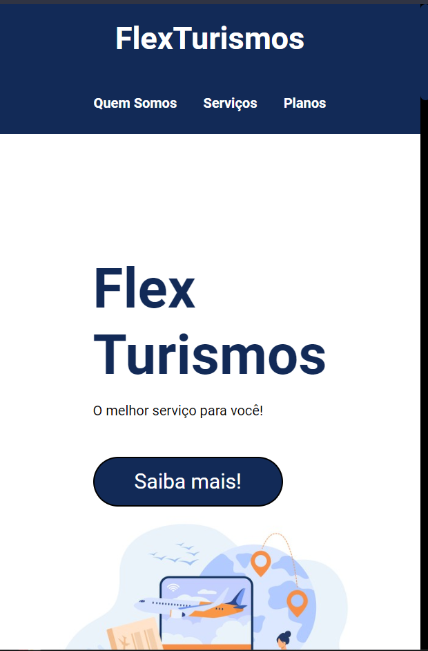
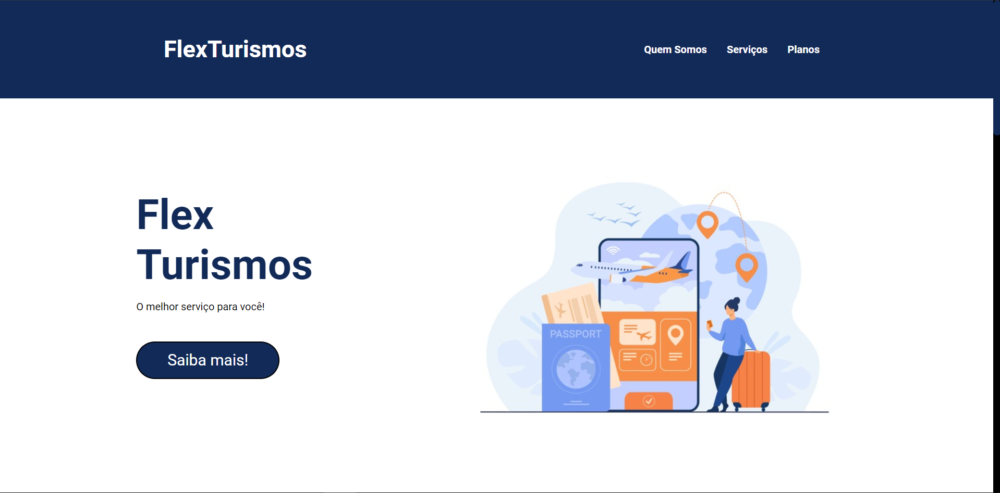

# FlexTourismos
----------------
Esse projeto foi desenvolvido como desafio do Bootcamp Spread Fullstack Developer da Digital Innovation One, no curso de flex-box, onde o objetivo era aplicar os conhecimentos obtidos por meio de um projeto, utilizando todos os conhecimentos.

**Tecnologias** usadas:  

**Responsivo**: *Sim*

**Screenshots** da página:

**Mobile**:

**Desktop**:

**Link**: https://thiagothree.github.io/FlexTourismos/